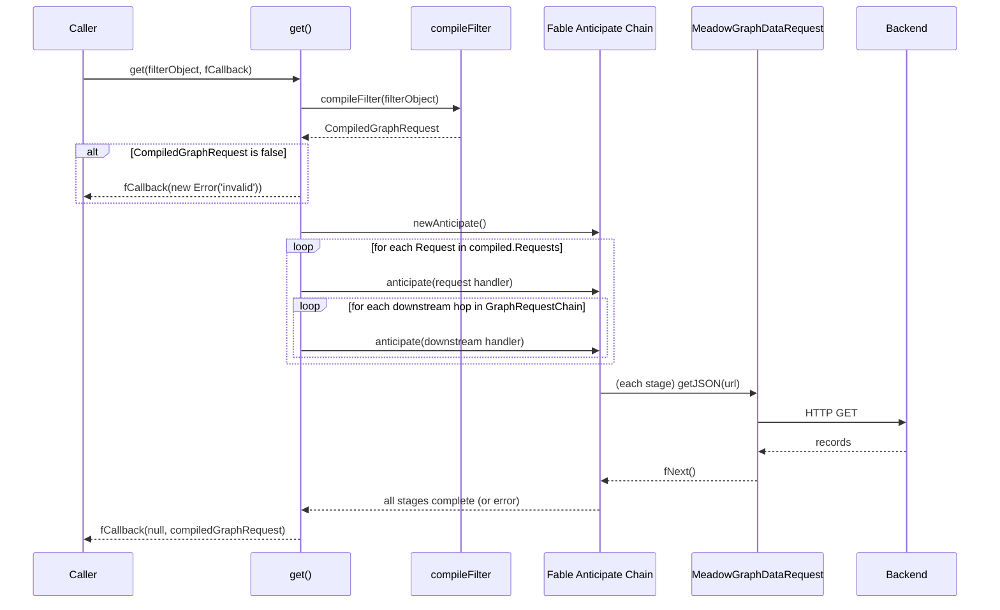

# get

The primary query entry point. Compile a filter object into a request plan and execute the plan against the configured data-request transport. This is the method you'll call 99% of the time in production code.

## Signature

```javascript
get(pFilterObject, fCallback)
```

| Parameter | Type | Description |
|-----------|------|-------------|
| `pFilterObject` | object | A filter object with at least an `Entity` field |
| `fCallback` | function | Node-style callback with signature `(pError, pCompiledGraphRequest)` |

**Does not return anything.** Result is delivered via the callback.

## When to Use It

Always. Unless you're writing tests, tooling, or dry-run explain plans, `get()` is the right entry point.

## Code Example: Basic Query

```javascript
const libFable = require('fable');
const libMeadowGraphClient = require('meadow-graph-client');

const _Fable = new libFable();
_Fable.addServiceType('MeadowGraphClient', libMeadowGraphClient);

let _GraphClient = _Fable.instantiateServiceProvider('MeadowGraphClient',
    {
        DataModel: require('./schema/my-schema.json')
    });

_GraphClient.get(
    {
        Entity: 'Book',
        Filter:
        {
            'Author.IDAuthor': 107,
            'BookPrice.Discountable': true
        }
    },
    (pError, pCompiledGraphRequest) =>
    {
        if (pError)
        {
            console.error('Query failed:', pError.message);
            return;
        }

        console.log('Query plan executed:');
        for (let tmpRequest of pCompiledGraphRequest.Requests)
        {
            console.log(`  ${tmpRequest.Entity}: ${tmpRequest.Result?.length || 0} records`);
        }
    });
```

## Code Example: With Options and Hints

```javascript
_GraphClient.get(
    {
        Entity: 'Book',
        Filter:
        {
            'Author.Name': 'Dan Brown',
            'Title': 'The%'
        },
        Options:
        {
            RecordLimit: 500,
            PageSize: 50
        },
        Hints: ['BookAuthorJoin']
    },
    (pError, pCompiled) =>
    {
        if (pError) return console.error(pError);
        // pCompiled.Requests is the executed plan
    });
```

## Code Example: Pivotal-Only Query (No Cross-Entity Filters)

```javascript
_GraphClient.get(
    {
        Entity: 'Book',
        Filter:
        {
            Title: 'The%',
            PublicationYear: { Column: 'PublicationYear', Operator: '>=', Value: 2000 }
        }
    },
    (pError, pCompiled) =>
    {
        if (pError) return console.error(pError);

        // Because both filters target Book itself, RequiredEntities is just ['Book']
        // and Requests[] is empty — no downstream queries needed
        console.log('Required:', pCompiled.ParsedFilter.RequiredEntities);
        // → ['Book']
    });
```

## Code Example: Deeply Nested Query

```javascript
// Customer email → which Orders → which OrderItems → which Products → which Category
_GraphClient.get(
    {
        Entity: 'Product',
        Filter:
        {
            'Customer.Email': 'alice@example.com',
            'Category.Name': 'Books'
        }
    },
    (pError, pCompiled) =>
    {
        if (pError) return console.error(pError);

        // The compiler will solve two paths:
        //   Product → OrderItem → Order → Customer
        //   Product → CategoryProductJoin → Category
        // Both are executed in order, with intermediate hops pulled automatically.
    });
```

## Execution Flow



## What Actually Happens

1. `compileFilter(pFilterObject)` produces a request plan (`CompiledGraphRequest`).
2. If the plan is `false`, `get` immediately calls `fCallback` with an error and returns.
3. A Fable `Anticipate` chain is created to sequence the async work.
4. For each `Request` in the compiled plan, an `anticipate` stage is pushed. Inside each stage, a log message is emitted and the request's downstream chain is walked.
5. For each entity in the `GraphRequestChain`, another `anticipate` stage is pushed to make the downstream request.
6. `anticipate.wait(callback)` kicks off the whole chain.
7. When the chain completes, the final request is made for the pivotal entity and the callback is invoked with the fully-populated compiled graph request.

**Note on the current implementation:** the actual HTTP calls are stubbed in the reference implementation. In a production deployment you'll provide a real `MeadowGraphDataRequest` override that performs the actual HTTP/IPC work inside `doGetJSON`. See the [Data Request Service](data-request-service.md) page.

## Error Handling

`get` passes an `Error` to the callback when:

- The filter object failed to compile (via `compileFilter`). The error is `new Error('Meadow Graph Client: The filter object is not valid.')`.
- Any anticipate stage propagates an error from its `fStageComplete(err)`.

When the transport itself returns an error for a request, the error is logged but may not halt the whole chain — the chain continues and the final callback is called with whatever partial results were gathered. Inspect the compiled graph request's `Requests[i].Result` arrays to see what actually succeeded.

## Customizing Transport

The `get` implementation doesn't reach for `http.request` directly — it delegates every outbound call to the Fable service registered under `options.DataRequestClientService` (default: `MeadowGraphClientDataRequest`). To make real HTTP requests, either:

1. Override `MeadowGraphDataRequest.doGetJSON` in a subclass and point the client at it
2. Register a different Fable service that implements `getJSON` with the same signature and pass its name via `DataRequestClientService`

See [Data Request Service](data-request-service.md) for full details.

## Code Example: Full Custom Transport Setup

```javascript
const libFable = require('fable');
const libMeadowGraphClient = require('meadow-graph-client');
const libMeadowGraphDataRequest = require('meadow-graph-client/source/Meadow-Graph-Service-DataRequest.js');

// Real HTTPS client
const libHTTPS = require('https');

class HTTPSDataRequest extends libMeadowGraphDataRequest
{
    doGetJSON(pURL, fCallback)
    {
        libHTTPS.get(pURL, (pResponse) =>
        {
            let tmpBody = '';
            pResponse.on('data', (pChunk) => { tmpBody += pChunk; });
            pResponse.on('end', () =>
            {
                try
                {
                    return fCallback(null, JSON.parse(tmpBody));
                }
                catch (pError)
                {
                    return fCallback(pError, null);
                }
            });
        }).on('error', (pError) => fCallback(pError, null));
    }
}

const _Fable = new libFable();
_Fable.addServiceType('MeadowGraphClient', libMeadowGraphClient);
_Fable.addAndInstantiateSingletonService('MeadowGraphClientDataRequest', {}, HTTPSDataRequest);

let _GraphClient = _Fable.instantiateServiceProvider('MeadowGraphClient',
    {
        DataModel: mySchema
    });

// Now get() will make real HTTPS calls via HTTPSDataRequest.doGetJSON
_GraphClient.get(myFilterObject, (pError, pResult) => {
    // ...
});
```

## Related

- [compileFilter](api-compileFilter.md) — the inner stage `get` calls to build the plan
- [Data Request Service](data-request-service.md) — how to plug in a real transport
- [Filter DSL Reference](filter-dsl.md) — every shape the first argument can take
- [Quick Start](quickstart.md) — end-to-end walkthrough
