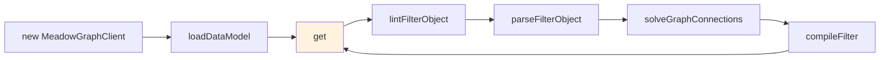

# API Reference

Complete reference for the public methods of `meadow-graph-client`. Each method has its own dedicated page with a full code snippet. This page is the index.

## Service Registration

Meadow Graph Client is a Fable service provider:

```javascript
const libFable = require('fable');
const libMeadowGraphClient = require('meadow-graph-client');

const _Fable = new libFable();
_Fable.addServiceType('MeadowGraphClient', libMeadowGraphClient);

let _GraphClient = _Fable.instantiateServiceProvider('MeadowGraphClient',
    {
        DataModel: mySchema,
        DefaultHints: { /* ... */ }
    });
```

After instantiation, call methods directly on the returned instance.

## Data Model Methods

| Method | Purpose | Details |
|--------|---------|---------|
| [`loadDataModel(pDataModel)`](api-loadDataModel.md) | Load an entire meadow schema object and register every table | [Details](api-loadDataModel.md) |
| [`addEntityToDataModel(pEntity)`](api-addEntityToDataModel.md) | Add a single meadow table to the graph | [Details](api-addEntityToDataModel.md) |
| [`cleanMissingEntityConnections()`](api-cleanMissingEntityConnections.md) | Remove dangling connections to entities not in the graph | [Details](api-cleanMissingEntityConnections.md) |

## Filter Methods

| Method | Purpose | Details |
|--------|---------|---------|
| [`lintFilterObject(pFilterObject)`](api-lintFilterObject.md) | Validate a filter object and fill in missing defaults | [Details](api-lintFilterObject.md) |
| [`parseFilterObject(pFilterObject)`](api-parseFilterObject.md) | Parse a filter object into canonical form grouped by entity | [Details](api-parseFilterObject.md) |
| [`buildFilterExpression(pEntity, pKey, pValue)`](api-buildFilterExpression.md) | Build a single canonical filter expression from a raw entry | [Details](api-buildFilterExpression.md) |
| [`convertFilterObjectToFilterString(pArray)`](api-convertFilterObjectToFilterString.md) | Emit a meadow-endpoints filter string from an expression array | [Details](api-convertFilterObjectToFilterString.md) |

## Graph Solving

| Method | Purpose | Details |
|--------|---------|---------|
| [`solveGraphConnections(pStart, pDest, pHints)`](api-solveGraphConnections.md) | Find all valid traversal paths between two entities and return the highest-scoring one | [Details](api-solveGraphConnections.md) |

## Query Execution

| Method | Purpose | Details |
|--------|---------|---------|
| [`compileFilter(pFilterObject)`](api-compileFilter.md) | Run lint + parse + solve and produce a ready-to-execute request plan | [Details](api-compileFilter.md) |
| [`get(pFilterObject, fCallback)`](api-get.md) | **Primary query entry point.** Compile and execute a filter against the transport | [Details](api-get.md) |

## Properties (Inspection)

These aren't methods, but they're the instance state you'll want to look at for debugging:

| Property | Type | Description |
|----------|------|-------------|
| `_KnownEntities` | object | Map of `EntityName -> { ColumnName -> ColumnDefinition }` for every loaded entity |
| `_OutgoingEntityConnections` | object | `Entity -> { TargetEntity -> ColumnName }` adjacency map |
| `_OutgoingEntityConnectionLists` | object | `Entity -> [TargetEntity, ...]` list form of outgoing connections |
| `_IncomingEntityConnections` | object | `Entity -> { SourceEntity -> ColumnName }` adjacency map |
| `_IncomingEntityConnectionLists` | object | `Entity -> [SourceEntity, ...]` list form of incoming connections |
| `_GraphSolutionMap` | object | Cached solved graph solutions keyed by `EdgeTraversalEndpoints` |
| `_DefaultHints` | object | Default hints loaded from constructor options |
| `_DefaultManualPaths` | object | Default manual paths loaded from constructor options |
| `options` | object | The fully-merged options object (defaults + user) |

Underscore-prefixed properties are internal implementation details; rely on them for debugging and tests, not for production code paths.

## Typical Usage Flow



The orange box (`get`) is the primary entry point. Everything else is either a lifecycle step (`loadDataModel`), an internal stage the compiler runs for you, or a lower-level method you can call directly if you want finer control.

## Lower-Level Methods

These methods are public but are usually called internally during `get()`. They're documented here for completeness and for cases where you want to introspect or override individual stages of the pipeline:

| Method | Called By | Purpose |
|--------|-----------|---------|
| `addOutgoingConnection(pColumn, pFrom, pTo)` | `addEntityToDataModel` | Register an outgoing edge |
| `addIncomingConnection(pColumn, pTo, pFrom)` | `addEntityToDataModel` | Register an incoming edge |
| `getDefaultFilterExpressionOperator(pDataType)` | `buildFilterExpression` | Resolve column data type to default operator |
| `getMeadowFilterType(pConnector, pOperator)` | `buildFilterExpression` | Map connector + operator to meadow filter type (`FBV`, `FBVOR`, `FOP`, `FCP`) |
| `getFilterComparisonOperator(pOperator)` | `convertFilterObjectToFilterString` | Map user-facing operator (`=`, `!=`) to meadow opcode (`EQ`, `NE`) |
| `generateRequestPath(pBase, pEndpoint)` | `solveGraphConnections` | Walk a graph connection tree backwards to emit an ordered request path |
| `gatherConnectedEntityData(...)` | `get` | Low-level helper that actually calls the data request service |

Most callers should never touch these directly. They're exposed as public so tests and advanced code paths can compose them, but production code should stick to `loadDataModel` + `get`.

## Error Handling

Most methods return `false` (or `null`) on error and log to `this.log.error(...)` with the reason. The one exception is `get()`, which takes a Node-style callback and passes errors as the first argument:

```javascript
_GraphClient.get(filterObject, (pError, pCompiledGraphRequest) =>
{
    if (pError)
    {
        console.error('Graph query failed:', pError.message);
        return;
    }
    // use pCompiledGraphRequest...
});
```

`solveGraphConnections()` returns a graph connection object whose `OptimalSolutionPath` will be `false` if no valid path was found; always check that field before using the solution.

`compileFilter()` returns `false` if `lintFilterObject` rejected the input.
