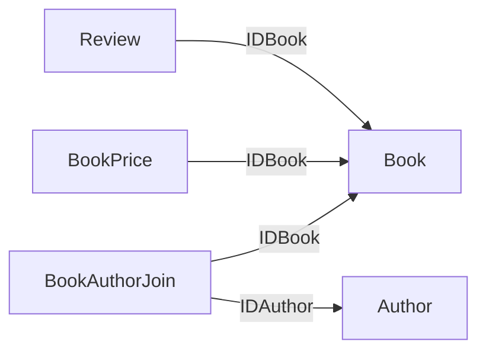
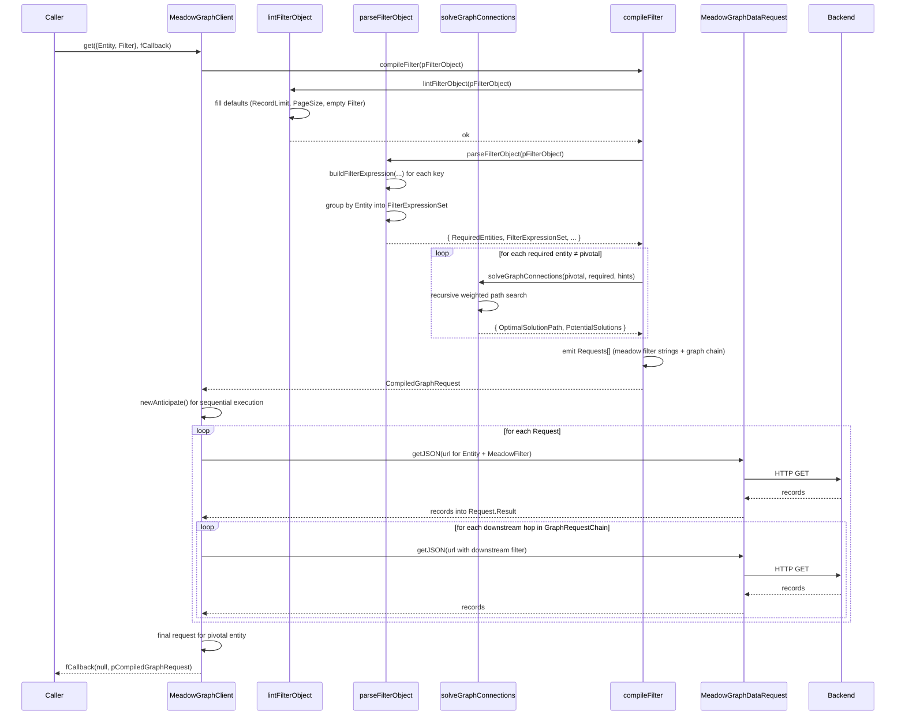
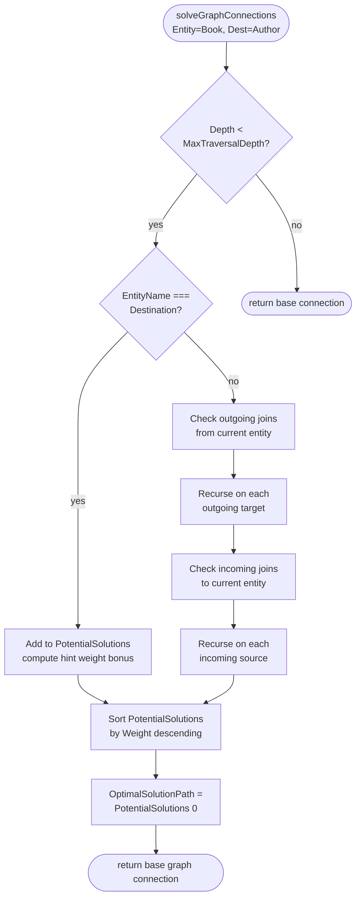
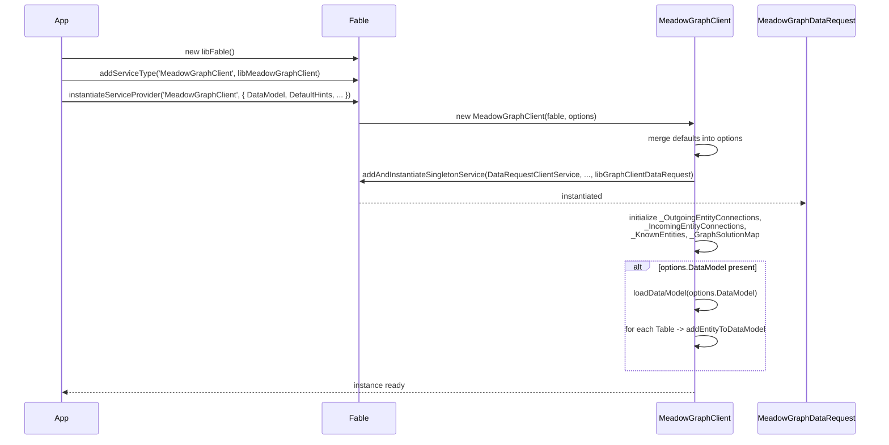

# Architecture

Meadow Graph Client is a small amount of actual logic wrapped in a Fable service provider. The core of the module is a pair of adjacency maps (outgoing and incoming join edges) and a recursive weighted breadth-then-depth graph solver. The rest is filter parsing, request compilation, and a stub transport layer that exists to be overridden.

## Layered Design

```
┌─────────────────────────────────────────────┐
│                   Fable                     │
│        (Service manager, logging)           │
└─────────────────────┬───────────────────────┘
                      │
┌─────────────────────▼───────────────────────┐
│            MeadowGraphClient                │
│   (Data model, solver, filter compiler)     │
└───────┬───────────────────────────────┬─────┘
        │                               │
┌───────▼──────────┐         ┌──────────▼────┐
│ Outgoing/Incoming │         │ MeadowGraph    │
│ Connection Maps   │         │ DataRequest    │
│ + KnownEntities   │         │ (pluggable)    │
└──────────────────┘         └────────────────┘
                                     │
                              ┌──────▼──────┐
                              │ Your HTTP/  │
                              │ IPC/test    │
                              │ backend     │
                              └─────────────┘
```

- **Fable** -- standard service-provider framework with logging, config, and lifecycle
- **MeadowGraphClient** -- the main class; holds the data model and exposes every public method
- **Connection Maps** -- two parallel `Object` adjacency representations of the join graph: `_OutgoingEntityConnections` (from -> to) and `_IncomingEntityConnections` (to -> from), each paired with a list form for stable iteration
- **MeadowGraphDataRequest** -- a stub sub-service that defines `getJSON` / `postJSON` / `putJSON` as overrideable template methods. The default stub returns `null` -- you're expected to either subclass it or swap in your own transport via the `DataRequestClientService` option

## The Data Model

When `loadDataModel()` is called, the client walks every table in the supplied meadow schema and:

1. Registers the table name in `_KnownEntities` with a column map
2. For every column that has a `Join` property (and isn't an audit column), registers both an outgoing connection on the source table and an incoming connection on the target table
3. Ignores `CreatingIDUser`, `UpdatingIDUser`, `DeletingIDUser`, and `IDCustomer` -- these are star/spoke audit joins, not graph edges

The meadow convention that the solver relies on:

- **ID columns are prefaced with `ID`** -- `IDBook`, `IDAuthor`, etc. The column name correlates with the table name.
- **Join tables are suffixed with `Join`** -- `BookAuthorJoin`, `ProductCategoryJoin`. This lets the solver apply a weight bonus to traversals that pass through join tables (which are usually the "right" answer).



The arrows are *outgoing joins* -- they point from the entity holding the `IDFoo` column toward the entity it references. The solver uses these in both directions: `Book -> BookAuthorJoin` is an *incoming* lookup from Book's perspective.

## Request Lifecycle -- `get()` End to End



Every stage can be called directly if you need finer control -- `lintFilterObject`, `parseFilterObject`, `solveGraphConnections`, and `compileFilter` are all public methods that can be composed outside the `get()` flow for testing or dry-run diagnostics.

## Graph Solver Internals

The solver is recursive with two traversal directions at each step:



Each recursion step:

1. Computes the current edge address (`Book-->BookAuthorJoin`, etc.) and adds it to the attempted-paths set
2. Checks depth; bails out if we're past `MaximumTraversalDepth`
3. If we're *at* the destination entity, records a potential solution with its weight
4. Otherwise, walks outgoing joins first (direct `IDFoo -> Foo`), then incoming joins (`Foo <- SomethingJoin`), recursing each time
5. At the base call, sorts all `PotentialSolutions` by weight descending and picks the highest as `OptimalSolutionPath`

### Weight Formula

```
weight = StartingWeight                    (default 100000)
       + (TraversalHopWeight × depth)       (default -100 per hop)
       + OutgoingJoinWeight                 (default +25 if hop was outgoing)
       + JoinInTableNameWeight              (default +25 if target name ends in 'Join')
       + HintWeight × (hints matched)       (default +200000 per hinted entity in path)
```

Tuning these knobs lets you bias the solver toward joining tables, avoiding joining tables, preferring shorter paths, or preferring specific named intermediate entities.

## Filter Compilation

```mermaid
flowchart LR
    Raw[Raw Filter Object<br/>{Entity, Filter: {...}}]
    Lint[lintFilterObject]
    Parse[parseFilterObject]
    Build[buildFilterExpression<br/>per filter entry]
    Group[Group by Entity into<br/>FilterExpressionSet]
    Solve[solveGraphConnections<br/>for each non-pivotal entity]
    Compile[compileFilter<br/>assembles Requests array]
    Strings[convertFilterObjectToFilterString<br/>emit meadow filter strings]
    Plan[CompiledGraphRequest]

    Raw --> Lint
    Lint --> Parse
    Parse --> Build
    Build --> Group
    Group --> Solve
    Solve --> Compile
    Compile --> Strings
    Strings --> Plan
```

Each filter entry walks through `buildFilterExpression`, which resolves its entity + column, picks a default operator based on the column's data type (LIKE for strings, `=` for numerics), and assigns a meadow filter type. The parsed filter object then groups expressions by their owning entity so the compiler knows which entities need requests.

## Data Request Service

The default `MeadowGraphDataRequest` stub provides template-method pairs for GET, POST, and PUT:

```
getJSON  -> onBeforeGetJSON  -> doGetJSON  -> onAfterGetJSON  -> fCallback
postJSON -> onBeforePostJSON -> doPostJSON -> onAfterPostJSON -> fCallback
putJSON  -> onBeforePutJSON  -> doPutJSON  -> onAfterPutJSON  -> fCallback
```

Override `doGetJSON` / `doPostJSON` / `doPutJSON` to plug in a real HTTP/IPC client. Override the `onBefore*` / `onAfter*` hooks to add cross-cutting concerns (auth headers, retry logic, tracing). The base-class `*JSON` controller methods chain them together so the override surface stays minimal.

## Design Trade-Offs

**Why not parse meadow schema into a full relational model?**
Overkill for the use case. The solver only needs to know which entity connects to which other entity via which column. A pair of adjacency maps is all that's required and produces a graph that's trivially walkable.

**Why weighted scoring instead of shortest-path or fixed rules?**
Different deployments want different things. A data warehouse with many join tables wants to favor the direct join-table path; a thin normalized model with few joins wants the shortest path; a specific business application may know that `BookAuthorJoin` is the canonical traversal even when `Rating` could also connect the dots. Weights let the solver accommodate all of these with configuration rather than forks of the code.

**Why not use `http-proxy` or a real HTTP client by default?**
Because the graph client is deployable in non-HTTP contexts -- in-process IPC, test fakes, or custom transports. Bundling an HTTP client would force a dependency on every consumer. The stub-and-override pattern keeps the package footprint tiny.

**Why cache graph solutions per-instance instead of per-call?**
Solving a graph is cheap (tens of microseconds) but repeatable queries against the same model benefit from reusing the same solution object. The cache currently lives in `_GraphSolutionMap` and is keyed by the edge-traversal endpoint string plus a hint hash. A future version may expose cache invalidation for dynamic schema updates.

**Why does the filter DSL allow both shorthand (`'Title': 'Foo%'`) and longhand (`'Title': { FilterType: 'InRecord', Value: 'Foo%' }`)?**
Developer ergonomics. The shorthand is good for 90% of real queries; the longhand exists for when you need to override the operator, connector, or filter type that the defaults would pick.

## Component Reference

| Component | File | Responsibility |
|-----------|------|----------------|
| `MeadowGraphClient` | `source/Meadow-Graph-Client.js` | Main service provider; data model, solver, compiler, request orchestration |
| `MeadowGraphDataRequest` | `source/Meadow-Graph-Service-DataRequest.js` | Pluggable transport stub with GET/POST/PUT template methods |

## What Happens At Instantiation


